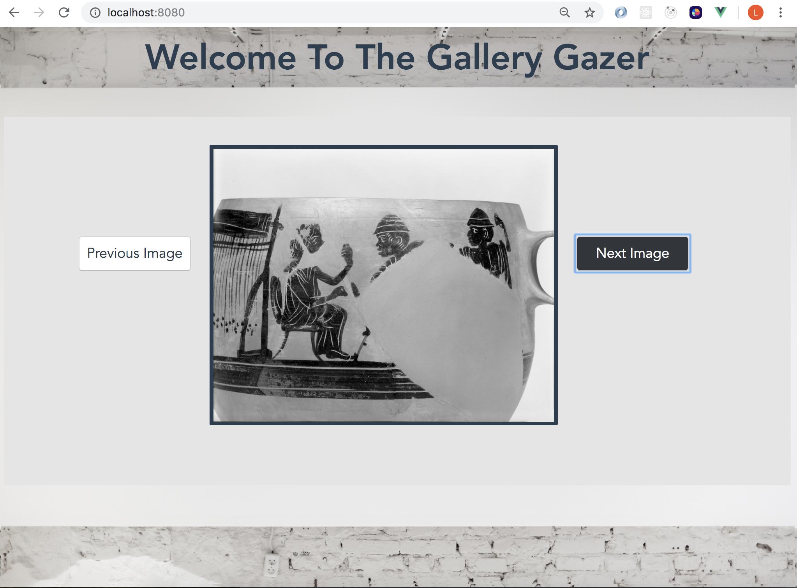

# Gallery Gazer

## Description

Gallery Gazer is a minimlistic app that shows a user images from the Harvard Art Museum API. It is a final project at Turing School of Software and Design, and is the first App I've built in Vue.js.

## Installation

  #### 1. Clone down and cd in to this repository 
  
  ```https://github.com/lboyer4/MuseumGallery.git```
  
  #### 2. Run npm install
  
  ```npm install```
  
  #### 3. Compile and Start App
  
  ```npm run serve```

_This app requires an api key that you can request from https://www.harvardartmuseums.org/collections/api_

## ScreenShot



